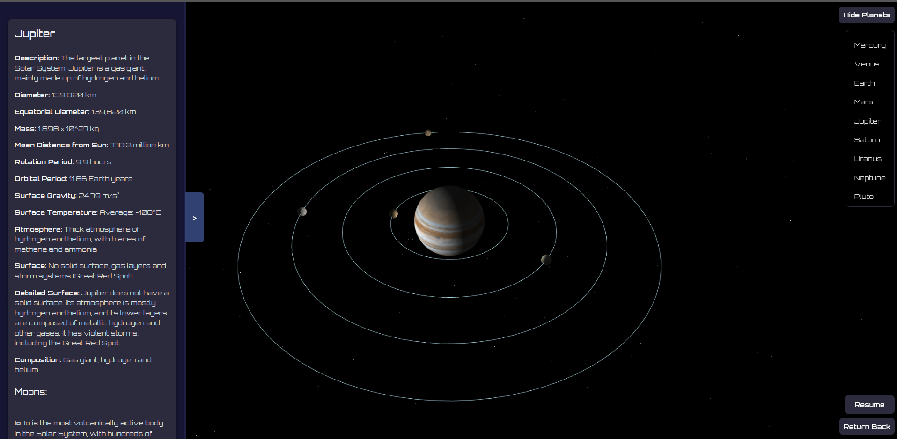

# Celestia

A web-based solar system simulation built using TypeScript and WebGL. This project allows you to visualize the solar system with interactive features.

## Features

- Rendering of planets and their orbits.
- Dynamic lighting effects using WebGL.
- Easy-to-use controls for navigation and interaction.

## Prerequisites

Make sure you have the following installed on your system:

- [Node.js](https://nodejs.org/) (version 16 or higher recommended)
- [npm](https://www.npmjs.com/) (comes with Node.js)
- A modern web browser (Google Chrome, Firefox, etc.)

## Getting Started

### 1. Clone the Repository

```bash
$ git clone https://github.com/nuochka/Celestia.git
$ cd Celestia
```

### 2. Install Dependencies

Run the following command to install the required dependencies:

```bash
$ npm install
```

### 3. Start the Development Server

Start the development server with:

```bash
$ npm start
```

This will:

- Build the project using Parcel.
- Serve the application at `http://localhost:1234`.

### 4. Serve with HTTP Server (For textures loading)

For a simple HTTP server with CORS support:

```bash
$ npx http-server --cors
```

You can then access the application at:

- `http://127.0.0.1:8080`
- `http://192.168.1.49:8080` (or similar local IPs)


## Screenshots

### Solar System


---

### Jupiter


---

### Mercury


---

### Uranus


